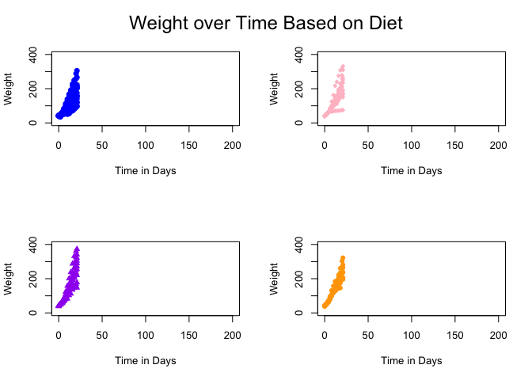
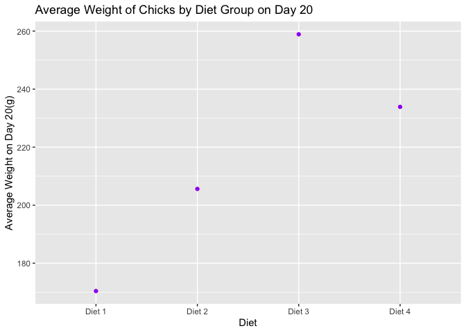
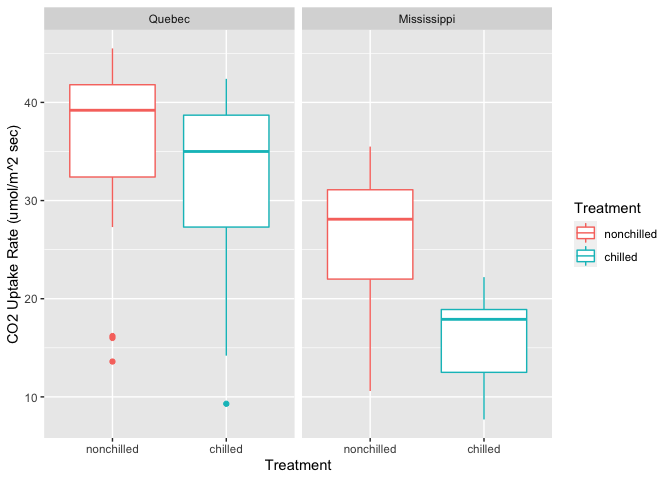
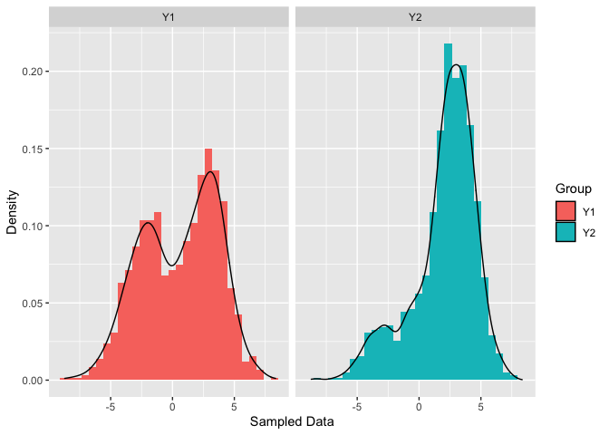

Final Project
================
Kara Rademeyer

#### Github package found at <https://github.com/rademeyerk/FinalProjectKMR>

``` r
library(ggplot2)
library(tidyverse)
```

    ## ── Attaching packages ─────────────────────────────────────── tidyverse 1.3.0 ──

    ## ✓ tibble  3.0.4     ✓ dplyr   1.0.2
    ## ✓ tidyr   1.1.2     ✓ stringr 1.4.0
    ## ✓ readr   1.4.0     ✓ forcats 0.5.0
    ## ✓ purrr   0.3.4

    ## ── Conflicts ────────────────────────────────────────── tidyverse_conflicts() ──
    ## x dplyr::filter() masks stats::filter()
    ## x dplyr::lag()    masks stats::lag()

``` r
#Plot #1 - Doing Scatterplots with GGplot
head(ChickWeight)
```

    ##   weight Time Chick Diet
    ## 1     42    0     1    1
    ## 2     51    2     1    1
    ## 3     59    4     1    1
    ## 4     64    6     1    1
    ## 5     76    8     1    1
    ## 6     93   10     1    1

``` r
chick<-(ChickWeight)
par(mfrow=c(2,2))
#A really long way to do this, but this makes subsets of the data by diet
Diet_One<-subset(chick, chick$Diet=="1")
Diet_Two<-subset(chick, chick$Diet=="2")
Diet_Three<-subset(chick, chick$Diet=="3")
Diet_Four<-subset(chick, chick$Diet=="4")
#plotting the subset of data and making it pretty with descriptions and colors 
plot(Diet_One$weight ~ Diet_One$Time, pch=19, xlab ="Time in Days", ylab="Weight", ylim=c(0,400), xlim=c(0,200), col="blue")
plot(Diet_Two$weight ~ Diet_Two$Time, pch=18, xlab ="Time in Days", ylab="Weight", ylim=c(0,400), xlim=c(0,200), col="pink")
plot(Diet_Three$weight ~ Diet_Three$Time, pch=17, xlab ="Time in Days", ylab="Weight", ylim=c(0,400), xlim=c(0,200), col="purple")
plot(Diet_Four$weight ~ Diet_Four$Time, pch=16, xlab ="Time in Days", ylab="Weight", ylim=c(0,400), xlim=c(0,200),col="orange")
mtext("Weight over Time Based on Diet", outer = T, cex = 1.5, line = -2.5)
```

<!-- -->

``` r
#Here we have a long string of pipes to determine the average weight of chicks 
#by diet group on the 20th day of the study where Time is 20. 
levels(ChickWeight$Diet) <- c("Diet 1","Diet 2","Diet 3","Diet 4") #Organize the data by diet. 
#The pipe is here 
Day20WeightAvg <-  filter(ChickWeight, (Time == 20)) %>%
  group_by(Diet, Time) %>%
  summarise(Mean = mean(weight))
```

    ## `summarise()` regrouping output by 'Diet' (override with `.groups` argument)

``` r
head(Day20WeightAvg) #This shows the four diets, with time 20, and the mean weight of the chicks on that day
```

    ## # A tibble: 4 x 3
    ## # Groups:   Diet [4]
    ##   Diet    Time  Mean
    ##   <fct>  <dbl> <dbl>
    ## 1 Diet 1    20  170.
    ## 2 Diet 2    20  206.
    ## 3 Diet 3    20  259.
    ## 4 Diet 4    20  234.

``` r
Day20WeightAvg$Time <- as.factor(Day20WeightAvg$Time) 
#Here I did a plot just to visualize the data for the mean weight on day 20 for each diet. 
ggplot(Day20WeightAvg, aes(x=Diet, y=Mean)) + geom_point(col="purple") + labs(x = 'Diet', y = 'Average Weight on Day 20(g)', title = "Average Weight of Chicks by Diet Group on Day 20") 
```

<!-- -->

``` r
#could have also made a pipestring like this, but this only shows the diet and the mean; where
#my other pipe included time 20. 
ChickWeight %>% group_by(Diet) %>% filter(Time == "20") %>% summarize("Weight" = mean(weight))
```

    ## `summarise()` ungrouping output (override with `.groups` argument)

    ## # A tibble: 4 x 2
    ##   Diet   Weight
    ##   <fct>   <dbl>
    ## 1 Diet 1   170.
    ## 2 Diet 2   206.
    ## 3 Diet 3   259.
    ## 4 Diet 4   234.

``` r
par(mfrow=c(1,1)) #reset the plot layouts. 

#Plot #2: Histograms with GGplot
data("CO2")
head(CO2)
```

    ##   Plant   Type  Treatment conc uptake
    ## 1   Qn1 Quebec nonchilled   95   16.0
    ## 2   Qn1 Quebec nonchilled  175   30.4
    ## 3   Qn1 Quebec nonchilled  250   34.8
    ## 4   Qn1 Quebec nonchilled  350   37.2
    ## 5   Qn1 Quebec nonchilled  500   35.3
    ## 6   Qn1 Quebec nonchilled  675   39.2

``` r
ggplot(data = CO2) + 
  geom_boxplot(aes(x = Treatment, y = uptake, color = Treatment)) + 
  facet_wrap(CO2$Type, 1, 2) + 
  labs(main = "CO2 Uptake Based on 2 Treatment Groups, Grouped by Region", y = "CO2 Uptake Rate (umol/m^2 sec)")
```

<!-- -->

``` r
#Function 1: Mixture Normal Distribution where if U=1, then Y will come from a normal distribution 
#with mean μ1 and standard deviation σ1,orif U=0, then Y will come from the other normal
#distribution with mean μ2 and standard deviation σ2.
library("purrr")
TheMixtureNormal <- function(p, mu1, mu2, sigma1, sigma2) {
  U <- rbernoulli(1, p = p)
  ifelse(U == 1, rnorm(1, mean = mu1, sd = sigma1), rnorm(1, mean = mu2, sd = sigma2))
}

set.seed(1024) #A seed for reproducibility

Y1 <- replicate(1000, TheMixtureNormal(0.5, -2, 3, 2, 1.5))
Y2 <- replicate(1000, TheMixtureNormal(0.2, -2, 3, 2, 1.5))
TheMixtureNormal_Data <- data.frame("Datapoint" = c(Y1, Y2), "Group" = c(rep("Y1", 1000), rep("Y2", 1000)))
#Creating a GG plot with the left panel containing the histogram 
#and a fitted density for Y1 and the right panel containing the same for Y2.
ggplot(data = TheMixtureNormal_Data) + 
  geom_histogram(aes(x = Datapoint, y = ..density.., fill= Group)) + 
  geom_density(aes(x = Datapoint)) +
  facet_grid(. ~ Group) + 
  labs(main = "Histograms of 2 Mixture Normal Distributions", x = "Sampled Data", y = "Density")
```

    ## `stat_bin()` using `bins = 30`. Pick better value with `binwidth`.

<!-- -->

``` r
#Function 2: simulate the weather forecast in Richmond. There are two states, sunny or rainy.
# If a day is sunny, the probability that the next day is sunny is 0.85. 
#If a day is rainy, the probability that the next day is rainy is 0.35. 
#If a day is rainy, the amount of rainfall accumulation in the city is governed by an Exponential(λ=2) 
#distribution, where the value from that distribution is the rainfall in inches. 
#If a day is sunny, there can be no rain.


ProbabilityMatrix <- matrix(c(0.85, 0.15, 0.65, 0.35), 2, 2, T)

RVATenDayWeather <- function(Initial) {
  StartRVA<- Initial
  ifelse(StartRVA == "Sunny", InitialVector <- c(1, 0), InitialVector <- c(0, 1))
  ForecastDF <- data.frame("Day" = 1:10, "Prediction" = rep(0, 10), "Rainfall" = rep(0, 10))
  for (i in 1:10) {
    TheNextDay <- InitialVector %*% ProbabilityMatrix
    NextDaySim <- rbernoulli(1, p = TheNextDay[1])
    ifelse(NextDaySim == 1, ForecastDF$Prediction[i] <- "Sun", ForecastDF$Prediction[i] <- "Rain")
    ifelse(NextDaySim == 0, ForecastDF$Rainfall[i] <- rexp(1, 2), ForecastDF$Rainfall[i] <- round(0, 1))
    TheNextDay <- TheNextDay %*% ProbabilityMatrix
  }
  
  ForecastDF %>% mutate("Sunny Days" = cumsum(Prediction == "Sun"), "Total Rainfall in Inches" = cumsum(Rainfall))
}

mean(replicate(1000, RVATenDayWeather("Sunny")$'Sunny Days'[10]))
```

    ## [1] 8.516

``` r
mean(replicate(1000, RVATenDayWeather("Rainy")$'Sunny Days'[10])) 
```

    ## [1] 6.489
